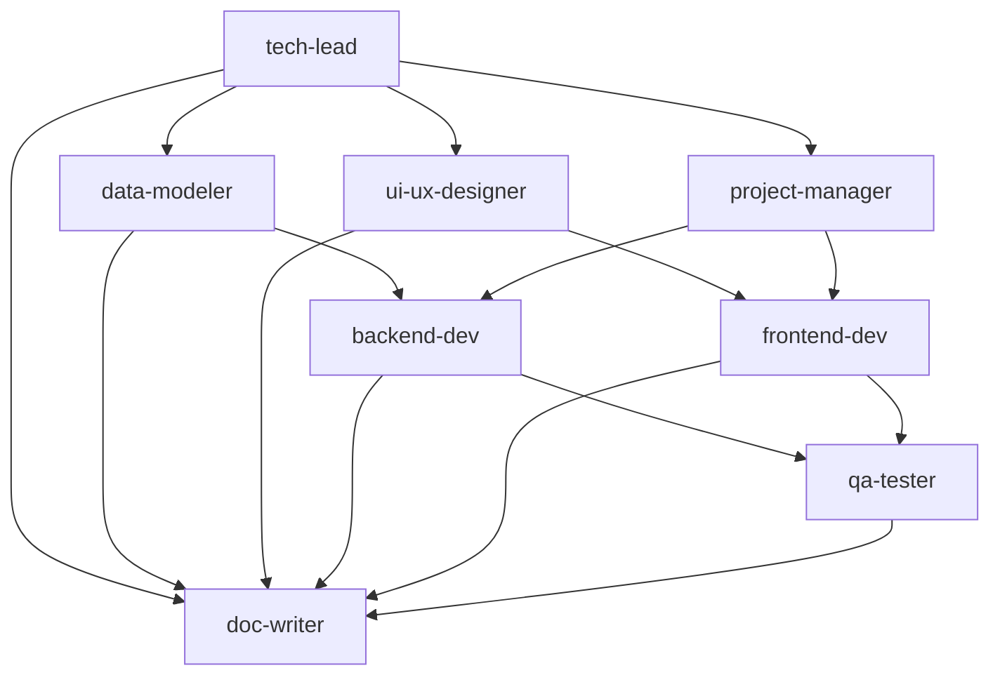

# Development Agents - Quick Reference

カスタムエージェント一覧とクイックリファレンス

> **Note**: All agents are now project-agnostic templates (v3.0.0). You must customize them with your project-specific information before use. See the "プロジェクトのカスタマイズ" section below.

## エージェント一覧

### 設計フェーズ (Phase 0)

#### 1. tech-lead
**Technical Architecture & System Design**

技術選定とシステム設計の責任者

- 技術スタック選定（モバイルフレームワーク、バックエンド、状態管理）
- システムアーキテクチャ設計（オフラインファースト）
- API設計（REST/GraphQL）
- セキュリティ要件定義

**主な成果物**: `tech-stack-decision.md`, `system-architecture.md`, `api-specification.md`, `security-requirements.md`

**使用例**:
```
Use the tech-lead agent to decide on the technology stack for your project
```

---

#### 2. ui-ux-designer
**UI/UX Design**

ユーザー体験設計とデザインシステム構築の責任者

- ワイヤーフレーム作成
- 画面遷移フロー設計
- 画面詳細仕様書作成
- デザインシステム定義（色、フォント、コンポーネント）
- UX最適化と検証

**主な成果物**: `wireframes.md`, `screen-transition-flow.md`, `screen-specifications/`, `design-system.md`

**使用例**:
```
Use the ui-ux-designer agent to create wireframes for your project screens
```

---

#### 3. data-modeler
**Database & Data Modeling**

データ構造の詳細設計の責任者

- エンティティ詳細定義
- リレーションシップ設計
- インデックス設計
- マイグレーション計画
- データバリデーションルール定義

**主な成果物**: `data-model-detailed.md`, `entity-relationship-diagram.md`, `migration-plan.md`

**使用例**:
```
Use the data-modeler agent to create detailed database schema for your entities
```

---

#### 4. project-manager
**Development Planning & Project Management**

開発計画策定とタスク管理の責任者

- 開発フェーズの詳細計画
- タスク優先順位付け
- マイルストーン設定
- 依存関係整理
- リスク管理

**主な成果物**: `mvp-development-plan.md`, `task-list.md`, `milestones.md`, `risk-management.md`

**使用例**:
```
Use the project-manager agent to create a detailed development plan for your project
```

---

### 実装フェーズ (Phase 1)

#### 5. backend-dev
**Backend Development**

サーバーサイドとデータ層の実装責任者

- 認証システム構築（email, Google, Apple）
- API開発（エンドポイント実装）
- データベースマイグレーション
- クラウド同期ロジック実装
- セキュリティ対策実装

**主な成果物**: バックエンドソースコード, `api-implementation.md`, `authentication-flow.md`

**使用例**:
```
Use the backend-dev agent to implement authentication endpoints for your API
```

---

#### 6. frontend-dev
**Frontend/Mobile Development**

モバイルアプリの実装責任者

- モバイルプロジェクトセットアップ
- 画面コンポーネント実装
- 状態管理実装
- コア機能実装
- オフライン対応実装
- データ同期実装（クライアント側）

**主な成果物**: モバイルアプリソースコード, `component-design.md`, `state-management-design.md`

**使用例**:
```
Use the frontend-dev agent to implement main screens for your application
```

---

#### 7. qa-tester
**Quality Assurance & Testing**

テスト戦略とテストコード作成の責任者

- テスト戦略策定
- ユニットテスト作成
- 統合テスト作成
- E2Eテスト作成
- パフォーマンステスト（応答時間、起動時間、リソース使用量）
- セキュリティチェック

**主な成果物**: テストコード, `test-strategy.md`, `test-coverage-report.md`, `performance-test-results.md`

**使用例**:
```
Use the qa-tester agent to write E2E tests for critical user flows
```

---

#### 8. doc-writer
**Documentation**

開発ドキュメントの整備と管理の責任者

- README作成
- 開発環境セットアップガイド
- API仕様書整備
- ユーザーガイド作成
- コントリビューションガイド
- プライバシーポリシー・利用規約ドラフト

**主な成果物**: `README.md`, `development-environment-setup.md`, `api-documentation.md`, `user-guide.md`

**使用例**:
```
Use the doc-writer agent to create project README and documentation
```

---

## エージェントの使用順序

### Phase 0: 設計準備

1. **tech-lead** → 技術スタック決定
2. **ui-ux-designer** → ワイヤーフレームと画面設計
3. **data-modeler** → データベーススキーマ設計
4. **project-manager** → MVP開発計画策定

### Phase 1: MVP開発

5. **backend-dev** → バックエンド実装
6. **frontend-dev** → モバイルアプリ実装
7. **qa-tester** → テスト実装
8. **doc-writer** → ドキュメント整備

## エージェント間の依存関係



## クイックリファレンス

| タスク | 使用するエージェント |
|-------|------------------|
| 技術スタック選定 | tech-lead |
| システムアーキテクチャ設計 | tech-lead |
| API設計 | tech-lead |
| ワイヤーフレーム作成 | ui-ux-designer |
| デザインシステム定義 | ui-ux-designer |
| データベーススキーマ設計 | data-modeler |
| マイグレーション計画 | data-modeler |
| タスク分解 | project-manager |
| リスク管理 | project-manager |
| 認証実装 | backend-dev |
| API実装 | backend-dev |
| 画面実装 | frontend-dev |
| コア機能実装 | frontend-dev |
| テスト戦略 | qa-tester |
| テストコード作成 | qa-tester |
| README作成 | doc-writer |
| API仕様書作成 | doc-writer |

## プロジェクトのカスタマイズ

### 重要: エージェントは汎用テンプレートです

全エージェント(v3.0.0)はプロジェクト非依存のテンプレートです。**使用前に必ずプロジェクト固有の情報を追記してください。**

### カスタマイズ方法

#### オプション1: 対話式カスタマイズ (推奨)

`/customize_agents` コマンドを使用すると、対話形式で質問に答えるだけで全エージェントを自動カスタマイズできます：

```
/customize_agents
```

このコマンドは以下を自動的に設定します：
- プロジェクト概要（名前、説明、ターゲット、プラットフォーム、MVP機能）
- 参照ドキュメントパス
- 技術的制約と優先事項
- コア機能とエンティティ
- 開発フェーズ計画
- テストシナリオ
- デザイン原則

#### オプション2: 手動カスタマイズ

各エージェントファイル(`.claude/agents/*.md`)の `<!-- ✏️ EDIT THIS SECTION -->` マーカーで示された箇所を手動で編集：

##### 全エージェント共通で必要な情報:
- **Project Overview**: プロジェクト名、概要、ターゲット、プラットフォーム、MVP機能

##### エージェント別の追加情報:

| エージェント | 追加カスタマイズが必要な項目 |
|------------|--------------------------|
| tech-lead | 参照ドキュメント、非機能要件、技術優先事項、プロダクト哲学 |
| ui-ux-designer | 参照ドキュメント、デザイン原則、必要画面一覧 |
| data-modeler | 参照ドキュメント、主要エンティティと属性 |
| project-manager | 参照ドキュメント、開発フェーズ計画 |
| backend-dev | 主要APIエンドポイント、パフォーマンス目標 |
| frontend-dev | 画面一覧と機能、コア機能、パフォーマンス目標 |
| qa-tester | 参照ドキュメント、重要テストシナリオ |
| devops-engineer | （Project Overviewのみ） |
| doc-writer | （Project Overviewのみ） |

### カスタマイズ例

#### 参照ドキュメント
```markdown
- **Requirements**: `./docs/requirements.md`
- **Product Concept**: `./docs/product-concept.md`
- **API Specification**: `./docs/api-spec.md`
```

#### 技術的制約
```markdown
- **Page load time**: Maximum 2 seconds
- **API response time**: <200ms (p95)
- **Concurrent users**: Support 1000+ concurrent users
- **Uptime**: 99.9% availability
```

#### プロダクト哲学
```markdown
- **User experience > Feature richness**
- **Performance > Visual complexity**
- **Security > Convenience**
```

詳細は `agents/README.md` および各エージェントファイル内の例を参照してください。

## さらに詳しく

- [エージェント使用例](examples/agent-usage-examples.md)
- [セットアップガイド](QUICKSTART.md)
- [エージェント詳細](agents/README.md)
- [カスタマイズコマンド](commands/customize_agents.md)
