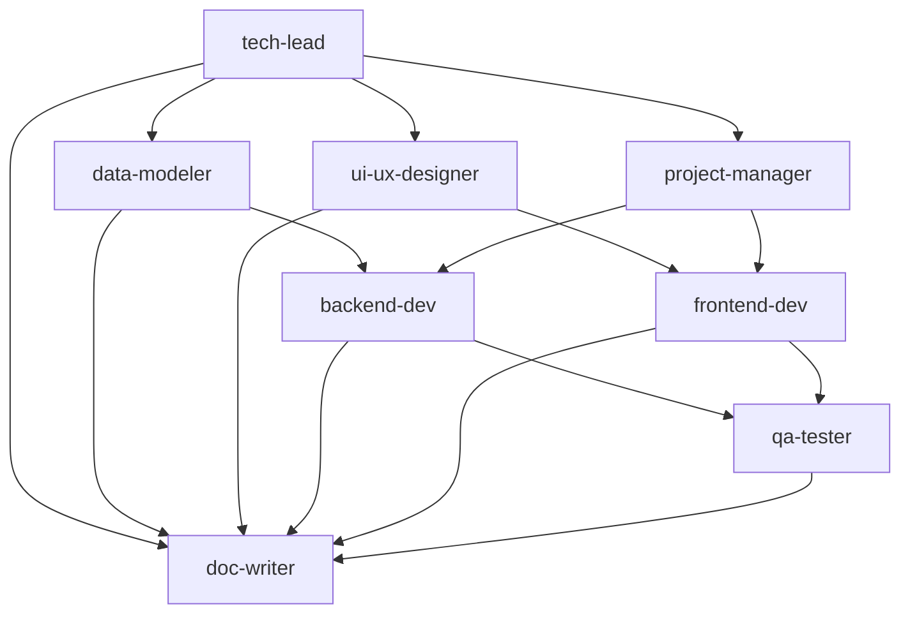

# StudyMate Development Agents

カスタムエージェント一覧とクイックリファレンス

## エージェント一覧

### 設計フェーズ (Phase 0)

#### 1. tech-lead
**Technical Architecture & System Design**

技術選定とシステム設計の責任者

- 技術スタック選定（モバイルフレームワーク、バックエンド、状態管理）
- システムアーキテクチャ設計（オフラインファースト）
- API設計（REST/GraphQL）
- セキュリティ要件定義

**主な成果物**: `tech-stack-decision.md`, `system-architecture.md`, `api-specification.md`, `security-requirements.md`

**使用例**:
```
Use the tech-lead agent to decide on the technology stack for StudyMate MVP
```

---

#### 2. ui-ux-designer
**UI/UX Design**

ユーザー体験設計とデザインシステム構築の責任者

- ワイヤーフレーム作成
- 画面遷移フロー設計
- 画面詳細仕様書作成
- デザインシステム定義（色、フォント、コンポーネント）
- 15秒記録完了のUX検証

**主な成果物**: `wireframes.md`, `screen-transition-flow.md`, `screen-specifications/`, `design-system.md`

**使用例**:
```
Use the ui-ux-designer agent to create wireframes for all MVP screens
```

---

#### 3. data-modeler
**Database & Data Modeling**

データ構造の詳細設計の責任者

- エンティティ詳細定義（User, Subject, StudySession）
- リレーションシップ設計
- インデックス設計
- マイグレーション計画
- データバリデーションルール定義

**主な成果物**: `data-model-detailed.md`, `entity-relationship-diagram.md`, `migration-plan.md`

**使用例**:
```
Use the data-modeler agent to create detailed database schema
```

---

#### 4. project-manager
**Development Planning & Project Management**

開発計画策定とタスク管理の責任者

- 開発フェーズの詳細計画
- タスク優先順位付け
- マイルストーン設定
- 依存関係整理
- リスク管理

**主な成果物**: `mvp-development-plan.md`, `task-list.md`, `milestones.md`, `risk-management.md`

**使用例**:
```
Use the project-manager agent to create a detailed MVP development plan
```

---

### 実装フェーズ (Phase 1)

#### 5. backend-dev
**Backend Development**

サーバーサイドとデータ層の実装責任者

- 認証システム構築（email, Google, Apple）
- API開発（エンドポイント実装）
- データベースマイグレーション
- クラウド同期ロジック実装
- セキュリティ対策実装

**主な成果物**: バックエンドソースコード, `api-implementation.md`, `authentication-flow.md`

**使用例**:
```
Use the backend-dev agent to implement authentication endpoints
```

---

#### 6. frontend-dev
**Frontend/Mobile Development**

モバイルアプリの実装責任者

- モバイルプロジェクトセットアップ
- 画面コンポーネント実装
- 状態管理実装
- タイマー機能実装（バックグラウンド対応）
- オフライン対応実装
- クラウド同期実装（クライアント側）

**主な成果物**: モバイルアプリソースコード, `component-design.md`, `state-management-design.md`

**使用例**:
```
Use the frontend-dev agent to implement the home screen with weekly progress
```

---

#### 7. qa-tester
**Quality Assurance & Testing**

テスト戦略とテストコード作成の責任者

- テスト戦略策定
- ユニットテスト作成
- 統合テスト作成
- E2Eテスト作成
- パフォーマンステスト（15秒制約検証、起動時間計測）
- セキュリティチェック

**主な成果物**: テストコード, `test-strategy.md`, `test-coverage-report.md`, `performance-test-results.md`

**使用例**:
```
Use the qa-tester agent to write E2E tests for the recording flow
```

---

#### 8. doc-writer
**Documentation**

開発ドキュメントの整備と管理の責任者

- README作成
- 開発環境セットアップガイド
- API仕様書整備
- ユーザーガイド作成
- コントリビューションガイド
- プライバシーポリシー・利用規約ドラフト

**主な成果物**: `README.md`, `development-environment-setup.md`, `api-documentation.md`, `user-guide.md`

**使用例**:
```
Use the doc-writer agent to create the project README
```

---

## エージェントの使用順序

### Phase 0: 設計準備

1. **tech-lead** → 技術スタック決定
2. **ui-ux-designer** → ワイヤーフレームと画面設計
3. **data-modeler** → データベーススキーマ設計
4. **project-manager** → MVP開発計画策定

### Phase 1: MVP開発

5. **backend-dev** → バックエンド実装
6. **frontend-dev** → モバイルアプリ実装
7. **qa-tester** → テスト実装
8. **doc-writer** → ドキュメント整備

## エージェント間の依存関係



## クイックリファレンス

| タスク | 使用するエージェント |
|-------|------------------|
| 技術スタック選定 | tech-lead |
| システムアーキテクチャ設計 | tech-lead |
| API設計 | tech-lead |
| ワイヤーフレーム作成 | ui-ux-designer |
| デザインシステム定義 | ui-ux-designer |
| データベーススキーマ設計 | data-modeler |
| マイグレーション計画 | data-modeler |
| タスク分解 | project-manager |
| リスク管理 | project-manager |
| 認証実装 | backend-dev |
| API実装 | backend-dev |
| 画面実装 | frontend-dev |
| タイマー実装 | frontend-dev |
| テスト戦略 | qa-tester |
| テストコード作成 | qa-tester |
| README作成 | doc-writer |
| API仕様書作成 | doc-writer |

## プロジェクト固有の設定

### 参照ドキュメント

全エージェントは以下のドキュメントを参照します：

- **要件定義**: `/Users/tomohirotakahashi/Documents/Obsidian Vault/studymate/要件定義.md`
- **エージェント作成指示書**: `/Users/tomohirotakahashi/Documents/Obsidian Vault/studymate/エージェント作成指示書.md`
- **プロダクトコンセプト**: `/Users/tomohirotakahashi/Documents/Obsidian Vault/Zettelkasten/PermanentNote/studymate_notes/学習記録アプリ プロダクトコンセプト整理（0→1）.md`
- **詳細要件**: `/Users/tomohirotakahashi/Documents/Obsidian Vault/Zettelkasten/PermanentNote/studymate_notes/学習記録アプリ 要件定義書.md`

### コアコンセプト

全エージェントが従うべきプロダクト哲学：

- **"今日もやった自分"を静かに肯定**
- **サボった日を責めない**
- **明日も机に戻りやすくする**
- **継続のしやすさ > 情報の正確さ**
- **気持ちの軽さ > 記録の網羅性**

### 技術的制約

全エージェントが守るべき非機能要件：

- 記録完了まで最大15秒
- アプリ起動3秒以内
- オフライン対応必須
- 60fpsのスムーズなアニメーション
- クラウド同期必須

## さらに詳しく

- [エージェント使用例](examples/agent-usage-examples.md)
- [セットアップガイド](README.md)
