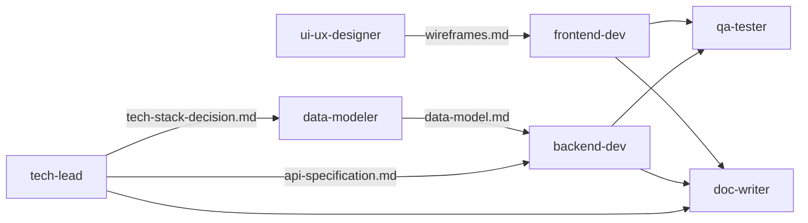

# Agents（エージェント）

Task toolで呼び出せる専門サブエージェントの定義を格納するディレクトリ。

## 概要

エージェントは特定の役割やスキルに特化したClaude Codeのサブプロセスです。メインのClaude Codeセッションから`Task`ツールを使って呼び出すことができます。

**Current Version**: 2.0.0
**Last Updated**: 2026-01-26
**Total Agents**: 9

## Version History

### Version 2.0.0 (2026-01-26)
- Added tool optimizations (Write/Edit/WebSearch)
- Added agent dependencies documentation
- Added quality checklists for all agents
- Added version management
- Added devops-engineer agent
- Changed tech-lead permissionMode to acceptEdits

### Version 1.0.0 (2026-01-25)
- Initial release with 8 core agents

## 現在利用可能なエージェント

### 設計フェーズ用エージェント

#### tech-lead.md
- **役割**: テックリード・アーキテクト
- **モデル**: opus（重要な技術判断に使用）
- **主な用途**:
  - 技術スタック選定
  - システムアーキテクチャ設計
  - API設計
  - セキュリティ要件定義
- **呼び出し例**:
  ```
  Use the tech-lead agent to decide on the technology stack
  ```

#### ui-ux-designer.md
- **役割**: UI/UXデザイナー
- **モデル**: sonnet
- **主な用途**:
  - ワイヤーフレーム作成
  - 画面遷移フロー設計
  - デザインシステム定義
  - UX検証
- **呼び出し例**:
  ```
  Use the ui-ux-designer agent to create wireframes for all screens
  ```

#### data-modeler.md
- **役割**: データモデリング専門家
- **モデル**: sonnet
- **主な用途**:
  - データベーススキーマ設計
  - ER図作成
  - インデックス戦略
  - マイグレーション計画
- **呼び出し例**:
  ```
  Use the data-modeler agent to design the database schema
  ```

#### project-manager.md
- **役割**: プロジェクトマネージャー
- **モデル**: sonnet
- **主な用途**:
  - タスク分解
  - マイルストーン設定
  - リスク管理
  - 開発計画策定
- **呼び出し例**:
  ```
  Use the project-manager agent to create a detailed development plan
  ```

### 実装フェーズ用エージェント

#### backend-dev.md
- **役割**: バックエンド開発者
- **モデル**: sonnet
- **主な用途**:
  - API実装
  - 認証システム構築
  - データベース操作
  - クラウド同期ロジック
- **呼び出し例**:
  ```
  Use the backend-dev agent to implement authentication endpoints
  ```

#### frontend-dev.md
- **役割**: フロントエンド/モバイル開発者
- **モデル**: sonnet
- **主な用途**:
  - モバイルアプリ実装
  - UI コンポーネント実装
  - 状態管理
  - オフライン対応
- **呼び出し例**:
  ```
  Use the frontend-dev agent to implement the home screen
  ```

#### qa-tester.md
- **役割**: QA/テストエンジニア
- **モデル**: sonnet
- **主な用途**:
  - テスト戦略策定
  - テストコード作成
  - パフォーマンステスト
  - 品質保証
- **呼び出し例**:
  ```
  Use the qa-tester agent to create comprehensive test cases
  ```

#### doc-writer.md
- **役割**: テクニカルライター
- **モデル**: sonnet
- **主な用途**:
  - README作成
  - API仕様書作成
  - ユーザーガイド作成
  - ドキュメント整備
- **呼び出し例**:
  ```
  Use the doc-writer agent to create the project documentation
  ```

## エージェントファイルの構造

各エージェントファイルは以下の構造を持ちます：

```markdown
---
name: agent-name
description: エージェントの説明。Claude Codeが自動的にエージェントを選択する際に使用
tools: Read, Write, Edit, Bash, Grep, Glob, WebSearch
model: sonnet  # または opus, haiku
permissionMode: default  # または acceptEdits, plan
---

[エージェントのシステムプロンプト]
```

### フロントマター（YAML）

- **name**: エージェント名（Task toolで指定する名前）
- **description**: エージェントの役割と使用タイミング
- **tools**: 使用可能なツールのリスト
- **model**: 使用するモデル（opus, sonnet, haiku）
- **permissionMode**: 権限モード
  - `default`: 通常モード（ユーザー確認が必要）
  - `acceptEdits`: ファイル編集を自動承認
  - `plan`: 読み取り専用モード

## カスタムエージェントの追加

新しいエージェントを追加する手順：

### 1. エージェントファイルを作成

```bash
cd ~/workspace/claude_utilization/agents
touch my-custom-agent.md
```

### 2. フロントマターを記述

```markdown
---
name: my-custom-agent
description: カスタムエージェントの説明
tools: Read, Write, Grep
model: sonnet
permissionMode: default
---
```

### 3. システムプロンプトを記述

エージェントの役割、責務、動作方法を詳細に記述します。

### 4. プロジェクトに適用

```bash
cd /path/to/your/project
bash ~/workspace/claude_utilization/setup.sh
```

## ベストプラクティス

### エージェント設計

1. **単一責任原則**: 各エージェントは明確な1つの役割に特化
2. **明確な説明**: `description`はClaude Codeが自動選択できるよう具体的に
3. **適切なモデル選択**:
   - `opus`: 複雑な設計判断、重要な決定
   - `sonnet`: 実装、テスト、ドキュメント作成
   - `haiku`: 高速な検索、軽量な操作

### ツール選択

- 必要なツールのみを許可（セキュリティと効率のため）
- 読み取り専用エージェントには Write/Edit を付与しない
- Web検索が必要な場合のみ WebSearch を追加

### システムプロンプト

- **役割**: エージェントの責務を明確に定義
- **参照ドキュメント**: 読むべきファイルのパスを明示
- **成果物**: 作成すべきドキュメント/コードを具体的に
- **制約**: 従うべきルールや制約を明記
- **例**: 使用例を含める

## エージェント間の連携

エージェントは独立して動作しますが、成果物を通じて連携します：



## トラブルシューティング

### エージェントが見つからない

```bash
# エージェントファイルの存在確認
ls -la ~/workspace/claude_utilization/agents/

# プロジェクトの .claude/agents/ を確認
ls -la .claude/agents/

# 再セットアップ
bash ~/workspace/claude_utilization/setup.sh
```

### エージェントが正しく動作しない

1. フロントマターの構文を確認（YAML形式が正しいか）
2. `name`フィールドがファイル名と一致しているか確認
3. `description`が明確で具体的か確認
4. 検証スクリプトを実行:
   ```bash
   cd ~/workspace/claude_utilization
   ./verify.sh
   ```

## 参考リンク

- [../AGENTS.md](../AGENTS.md) - エージェント一覧とクイックリファレンス
- [../examples/agent-usage-examples.md](../examples/agent-usage-examples.md) - 使用例
- [../README.md](../README.md) - フレームワーク全体の説明
